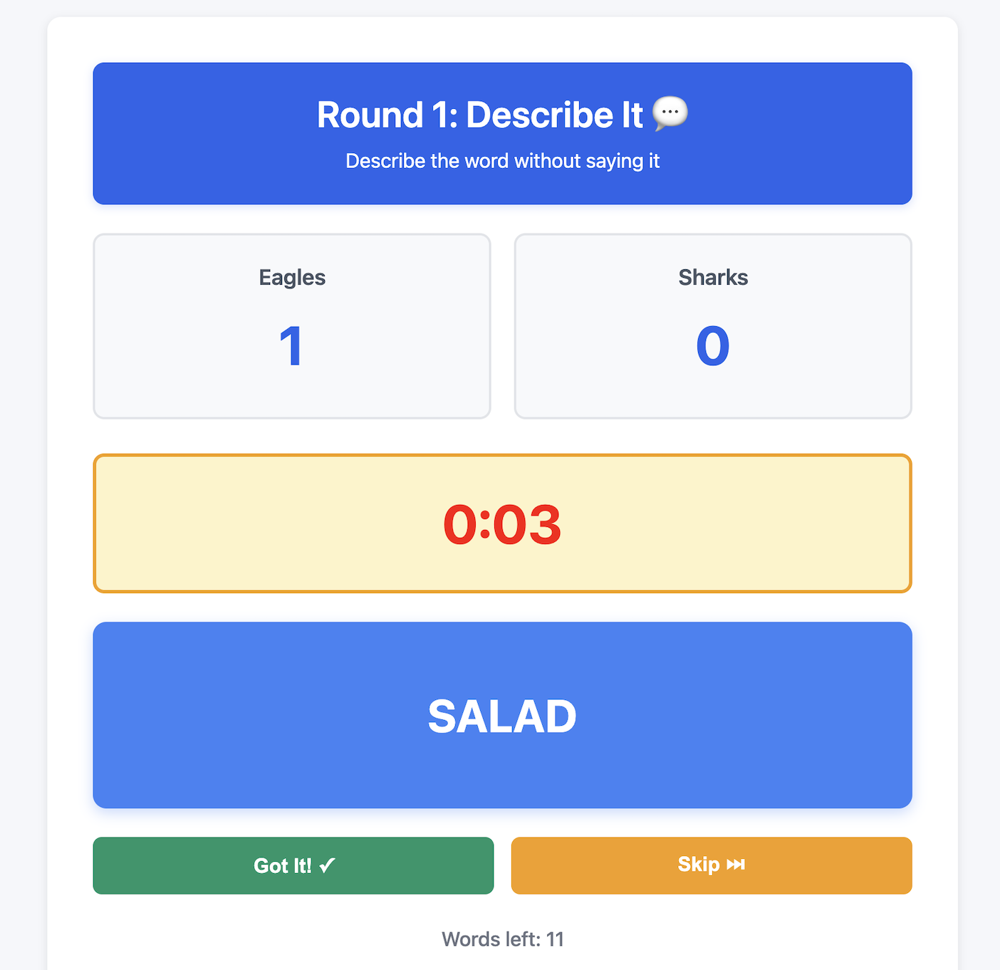
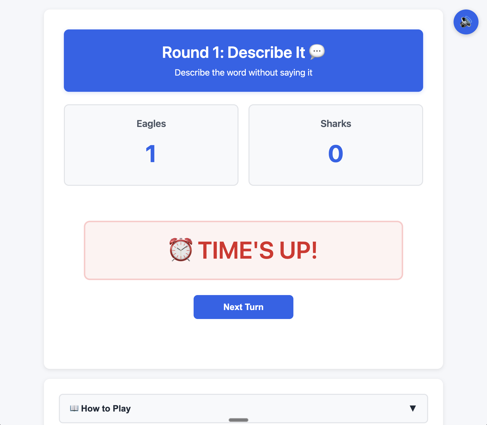

# ⏰ Time's Up! - Browser Word Guessing Game



A fast-paced, team-based word-guessing party game where players race against a 60-second timer to help their teammates guess as many words as possible across two challenging rounds!

**[🎮 Play Now!](https://lecharles.github.io/browser-game-time-s-up/)**

---

## 🎯 Game Overview

| Game Info | Details |
|-----------|---------|
| **Players** | 4-8 players (2 teams of 2-4) |
| **Duration** | 15-25 minutes |
| **Rounds** | 2 rounds with different rules |
| **Turn Length** | 60 seconds per turn |
| **Difficulty** | Easy to learn, challenging to master |

---

## 💡 Why I Built This

During the 2025 holidays, I played the traditional version of this game with friends and family. It was incredibly fun and brought everyone together, but the physical setup had issues:

- ❌ Writing words on paper scraps (they got lost)
- ❌ Managing a physical "hat" to draw from
- ❌ Inconsistent timing with different phone timers
- ❌ Manual score tracking (error-prone)
- ❌ Confusing turn order and round transitions

**This browser-based version solves all those problems:**

- ✅ Digital word collection (no lost scraps!)
- ✅ Consistent 60-second timer with audio alert
- ✅ Automatic score tracking
- ✅ Clear turn order management
- ✅ Round-specific rule displays
- ✅ Works on any device - just pass it around!

> **One Device, Many Players:** No app downloads, no accounts—just open the link and start playing!

---

## 🎮 How to Play

### Setup Phase (5 minutes)

#### Step 1: Form Teams
1. Gather 4-8 players total
2. Split into **2 equal teams** (2-4 players per team)
3. Enter creative team names
4. Add all player names for each team

#### Step 2: Submit Words
Each player contributes **3-5 words** to the shared pool:
- **People:** "Beyoncé", "Albert Einstein"
- **Places:** "Eiffel Tower", "Grand Canyon"
- **Things:** "Skateboard", "Pizza"
- **Concepts:** "Happiness", "Democracy"

**Tip:** Mix easy and challenging words for the best gameplay experience!

---

### Gameplay Phase

The game consists of **2 rounds** using the **same word pool**, but with different rules:

| Round | Description Rules | Icon |
|-------|------------------|------|
| **Round 1: Describe It** | Use any words to describe (except the word itself!) | 💬 |
| **Round 2: One Word** | Give only ONE single-word clue | 🔤 |

#### How Each Turn Works


1. **Click "Start Turn"** - The 60-second timer begins
2. **Random word appears** on screen
3. **Describe the word** following the current round's rules
4. **Teammates guess** - shout out answers!
5. **Click "Got It!"** when correct → +1 point, word removed, new word appears
6. **Click "Skip"** if stuck → word stays in pool, new word appears
7. **Repeat** until timer hits 0:00
8. **"TIME'S UP!"** → Pass device to next team



#### Scoring
- ✅ **Correct guess:** +1 point, word removed from pool
- ⏭️ **Skip:** No points, word stays for later turns
- 🎵 **Audio alert:** Bell rings when time's up (can be muted)

---

### Round Breakdown

#### Round 1: Describe It 💬
**Rules:** Describe using any words (just don't say the target word!)

**Example:**
- **Word:** "Volcano"
- **Good clue:** "A mountain that erupts with hot lava and ash!"
- **Bad clue:** "Vol—" ❌ (contains the word)

**Strategy:** Get through as many words as possible! Remembering them helps in Round 2.

---

#### Round 2: One Word 🔤
**Rules:** Give only ONE single-word clue (not the word itself)

**Example:**
- **Word:** "Volcano"
- **Good clue:** "Lava!"
- **Bad clue:** "Exploding mountain" ❌ (too many words)

**Strategy:** Think of the most distinctive keyword. Players will remember words from Round 1!

---

### Winning the Game

After both rounds:
1. **Total scores** are calculated automatically
2. **Round-by-round breakdown** shows each team's performance
3. **Highest score wins!** 🏆

---

## 🎯 Game Tips & Strategies

### For Describers
- **Round 1:** Be descriptive but quick - don't waste time on stuck words
- **Round 2:** Choose the most unique single word associated with the target
- **General:** Watch the timer! You have 60 seconds total

### For Guessers
- **Listen carefully** to every word
- **Shout out guesses** immediately - don't hesitate!
- **Remember Round 1** - those words repeat in Round 2

### Team Strategy
- **Communicate** after turns about which words are difficult
- **Stay positive** - some words are just hard!
- **Have fun** - it's about the laughs, not just the points

---

## 🎨 Features

- ⏱️ **Built-in 60-second timer** with visual countdown
- 🔊 **Audio alerts** when time's up (with mute option)
- 📊 **Automatic score tracking** for both teams
- 🎲 **Random word selection** from the pool
- 📱 **Responsive design** - works on phones, tablets, and computers
- 📖 **Collapsible instructions** - always available during gameplay
- ✨ **Clean, modern UI** built with vanilla JavaScript, HTML, and CSS

---

## 🛠️ Technologies Used

- **HTML5** - Structure and semantic markup
- **CSS3** - Styling with Flexbox for responsive layouts
- **JavaScript (ES6)** - Game logic, state management, and DOM manipulation
- **Web Audio API** - Timer alert sound
- **GitHub Pages** - Free hosting

---

## 🚀 How to Play

**Option 1: Play Online (Recommended)**

Simply visit: **[https://lecharles.github.io/browser-game-time-s-up/](https://lecharles.github.io/browser-game-time-s-up/)**

**Option 2: Run Locally**
```bash
# Clone the repository
git clone https://github.com/lecharles/browser-game-time-s-up.git

# Navigate to the project directory
cd browser-game-time-s-up

# Open index.html in your browser
open index.html
```

---

## 🎓 Development Journey

This project was built as part of my software engineering bootcamp to practice:
- **State management** in vanilla JavaScript
- **Event-driven programming** patterns
- **Flexbox layouts** for responsive design
- **DOM manipulation** and dynamic rendering
- **Game logic** implementation
- **User experience** design for multiplayer games

---

## 📝 Future Enhancements

Potential features for future versions:
- [ ] Round 3: Charades/Acting mode
- [ ] Customizable timer duration
- [ ] Pause/resume functionality
- [ ] More than 2 teams
- [ ] Word categories (Movies, Sports, etc.)
- [ ] Save game state to continue later
- [ ] Leaderboard across multiple games

---

## 🤝 Contributing

This is a learning project, but feedback and suggestions are welcome! Feel free to:
- Open an issue for bugs or feature requests
- Fork the repo and submit a pull request
- Share your gameplay experiences

---

## 📄 License

This project is open source and available under the MIT License.

---

## 👏 Acknowledgments

- Inspired by the classic party game "Time's Up!" and similar word-guessing games
- Created with ❤️ during holiday game nights with friends and family
- Built as part of my software engineering bootcamp journey

---

**Ready to play? [Start a game now!](https://lecharles.github.io/browser-game-time-s-up/)** 🎉

---

*Made by [lecharles](https://github.com/lecharles) | January 2026*